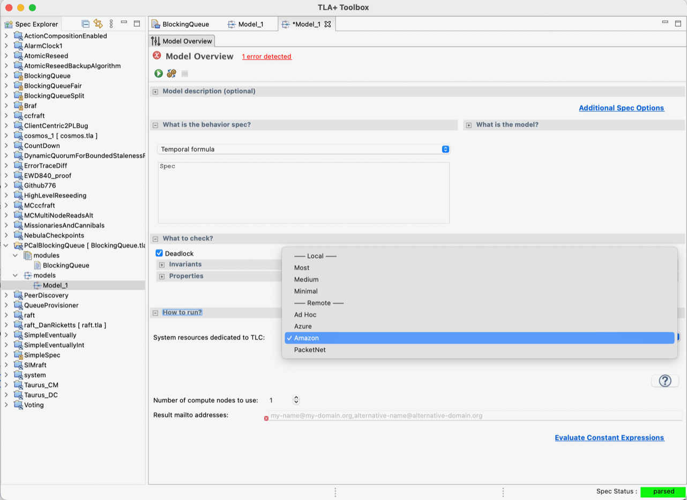

# Distributed mode and Cloud mode

When we need to model check a model that has a large state space, we can run tlc in distributed mode. In this mode, TLC will run in multiple machines. Cloud mode is distributed mode, but automatically spawns up instances in the supported clouds.

There have been no reported issues, and nothing is fundamentally broken with either Distributed TLC or Cloud TLC. However, we no longer have sponsored access to AWS to run Cloud TLC as part of our CI testing.  Additionally, cloud providers often change their APIs, and the jclouds library [1] that Cloud TLC depends on has not been updated in a while.  The dropdown menu for selecting the cloud has been moved in the Toolbox’s nightly build (see attached screenshot).

Distributed TLC can be used from the command line [2], but there is no support in the VSCode extension.

We've found that TLC’s simulation mode is very effective at finding counterexamples.  For instance, simulation mode found a variant of a counterexample in about 10 minutes, which took model checking two days to find. I recommend running TLC in simulation mode on a multi-core machine for an extended period before attempting large-scale exhaustive model checking on a single machine or using distributed model checking.

* [1] https://jclouds.apache.org <https://jclouds.apache.org/> and https://github.com/lemmy/jclouds2p2
* [2] https://tla.msr-inria.inria.fr/tlatoolbox/doc/model/distributed-mode.html

## Limitations
In distributed mode TLC cannot check liveness properties, nor check random or depth-first behaviours.

Distributed TLC does not support TLCGet/TLCSet operator. It would require synchronization among all (distributed) workers. In distributed mode, it is of limited use anyway. 

